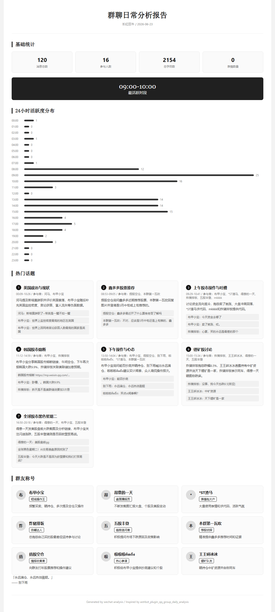
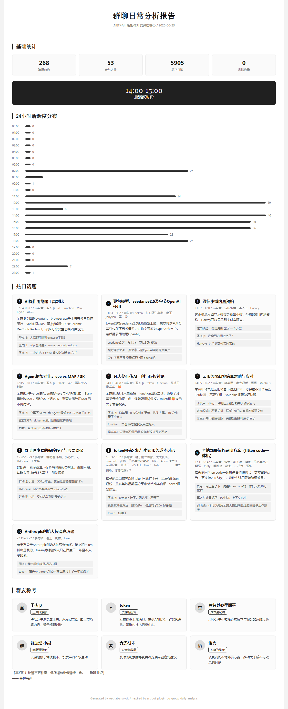

# ChatInsight — IM 聊天记录解密分析

解密本地 IM 聊天记录，查询消息，生成日报统计。

## 支持平台

| 平台 | 状态 | 加密方式 | 密钥来源 | 详细文档 |
|------|------|---------|---------|---------|
| **微信** | ✅ 完全可用 | SQLCipher 4 | wx_key.exe 内存提取 | [core-wechat/](core-wechat/) |
| **企业微信** | ⚠️ 可用 | wxSQLite3 AES-128-CBC | wechat-decrypt 内存扫描 | [core-wecom/](core-wecom/) |
| **钉钉** | ✅ 完全可用 | AES-128-ECB | UID+salt→PBKDF2→MD5 | [core-dingtalk/](core-dingtalk/) |
| **飞书** | ❌ 暂不可行 | SQLCipher | 需要 app_secret | [core-feishu/](core-feishu/) |

### 加密方案发现过程

所有平台的加密方案均通过**逆向分析**确认：
- 微信：分析 `Weixin.exe` 进程内存中的 `sqlite3_key` 调用
- 企微：扫描 `WXWork.exe` 进程内存中的 wxSQLite3 密钥
- 钉钉：逆向 `liblark.dll` 中的 AES-ECB 加密逻辑 + 看雪论坛逆向分析
- 飞书：逆向 `liblark.dll` 发现需要服务器端 `app_secret`

## 效果展示

<p align="center">
  
  
</p>

## 项目结构

```
├── wechat.py              # CLI 入口
├── config.jsonc            # 本地配置
├── core-wechat/           # 微信解密（完全独立）
├── core-wecom/            # 企业微信解密（完全独立）
├── core-dingtalk/         # 钉钉解密（完全独立）
├── core-feishu/           # 飞书（预留）
├── shared/                # 平台抽象基类
├── api/                   # 后端 API（FastAPI）
├── web/                   # 前端（Vue + Tailwind + Highcharts）
├── scripts/               # 辅助脚本
├── tests/                 # 测试
├── tools/                 # 外部工具（git submodule）
├── export_parse_result/   # 输出目录（gitignore）
└── _docs/                 # 文档
```

每个平台目录完全独立，互不依赖。

## 快速开始

### 微信

```bash
# 1. 提取密钥（微信保持运行）
tools\wx_key\wx_key.exe  # 复制 64 位 hex

# 2. 初始化
python wechat.py setup --raw-key <raw_key>

# 3. 解密
python wechat.py decrypt

# 4. 生成日报
python wechat.py report
```

### 钉钉

```bash
# 1. 自动提取 UID
python core-dingtalk/find_uid.py

# 2. 解密
python core-dingtalk/decrypt.py

# 3. 导出数据
python core-dingtalk/export_all.py
```

### Web 界面

```bash
# 启动后端
python -m uvicorn api.server:app --port 8765

# 启动前端
cd web && pnpm dev
```

## 安装

```bash
git submodule update --init --recursive
pip install -r requirements.txt
cp config.example.jsonc config.jsonc
```

## LLM 配置

编辑 `config.jsonc`：

```json
{
  "llm": {
    "auth_token": "your_api_key",
    "base_url": "https://api.deepseek.com/anthropic",
    "model": "anthropic/deepseek-v4-flash"
  }
}
```

## 依赖

- Python 3.10+
- pycryptodome, sqlcipher3, litellm, fastapi, uvicorn
- Node.js (前端: pnpm + Vue 3 + Tailwind + Highcharts)

## 致谢

- [WeChatDecrypt](https://github.com/ylytdeng/wechat-decrypt) — 微信数据库解密
- [wx_key](https://github.com/ycccccccy/wx_key) — 微信密钥提取
- [dingwave-V3](https://github.com/E2ern1ty/dingwave-V3) — 钉钉数据库解密
